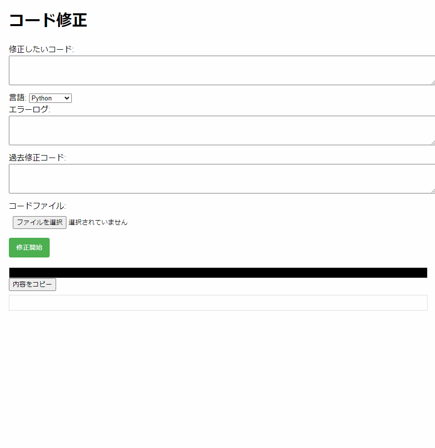
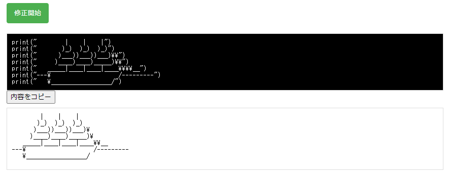

# コード生成の自動化プロト

以下の内容を参考に要求とファイル構造を入力として、要求を実現するコードをファイル構造に合わせて生成する

## やること

1. コードエラーをLLMを使い実施する
    - [The Right Prompts for the Job: Repair Code-Review Defects with Large Language Model](https://arxiv.org/abs/2312.17485)の P1, 2, 5, 6 のプロンプト例を参考にエラーログとプログラム言語を指定してエラーコードを修正する




例
- 修正前コード
```python
# エラー用のコード
# 三目並べ 
# 行 列 と入力したときにその位置に手を指す
import random

def print_board(board):
    # clear_output(wait=True)
    for row in board:
        print(" | ".join(row))
        print("-" * 5)

def check_winner(board, player):
    for row in board:
        if all(s == player for s in row):
            return True
    for col in range(3):
        if all(board[row][col] == player for row in range(3)):
            return True
    if all(board[i][i] == player for i in range(3)):
        return True
    if all(board[i][2 - i] == player for i in range(3)):
        return True
    return False

def get_empty_cells(board):
    return [(i, j) for i in range(3) for j in range(3) if board[i][j] == " "]


def find_block_move(board, player):
    for row in range(3):
        if board[row].count(player) == 2 and " " in board[row]:
            return row, board[row].index(" ")

    for col in range(3):
        column = [board[row][col] for row in range(3)]
        if column.count(player) == 2 and " " in column:
            return column.index(" "), col

    diagonal1 = [board[i][i] for i in range(3)]
    if diagonal1.count(player) == 2 and " " in diagonal1:
        return diagonal1.index(" "), diagonal1.index(" ")

    diagonal2 = [board[i][2 - i] for i in range(3)]
    if diagonal2.count(player) == 2 and " " in diagonal2:
        return diagonal2.index(" "), 2 - diagonal2.index(" ")

    return None

def auto_place_o(board):
    block_move = find_block_move(board, "X")
    if block_move:
        row, col = block_move
        board[row][col] = "O"
    else:
        empty_cells = get_empty_cells(board)
        if empty_cells:
            row, col = random.choice(empty_cells)
            board[row][col] = "O"
# エラーになる処理の追加
def tic_tac_toe_jupyter():
    board = [[" " for _ in range(3)] for _ in range(3)]
    current_player = "X"
    turns = 0  # ターン数を追跡

    while True:
        print_board(board)
        if current_player == "X":
            try:
                row, col = map(int, input("Player X, enter row and column (1-3): ").split())
                row, col = row - 1, col - 1
                if board[row][col] != " ":
                    print("Cell is already taken. Please try again.")
                    continue
            except (ValueError, IndexError):
                print("Invalid input. Please enter row and column numbers from 1 to 3.")
                continue
            board[row][col] = "X"
        else:
            auto_place_o(board)

        turns += 1
        if turns == 3:  # 追加
            current_player = current_player[1]  # 不正なインデックスアクセス

        if check_winner(board, current_player):
            print_board(board)
            print(f"Player {current_player} wins!")
            break

        if all(all(cell != " " for cell in row) for row in board):
            print_board(board)
            print("It's a tie!")
            break

        current_player = "O" if current_player == "X" else "X"

    if input("Play again? (yes/no): ").lower().startswith("y"):
        tic_tac_toe_jupyter()

tic_tac_toe_jupyter()
```
- 修正後コード
```python
def tic_tac_toe_jupyter():
    board = [[" " for _ in range(3)] for _ in range(3)]
    current_player = "X"
    turns = 0  # ターン数を追跡

    while True:
        print_board(board)
        if current_player == "X":
            try:
                row, col = map(int, input("Player X, enter row and column (1-3): ").split())
                row, col = row - 1, col - 1
                if board[row][col] != " ":
                    print("Cell is already taken. Please try again.")
                    continue
                board[row][col] = "X"
            except (ValueError, IndexError):
                print("Invalid input. Please enter row and column numbers from 1 to 3.")
                continue
        else:
            auto_place_o(board)

        turns += 1
        if turns == 3:  # エラーを導入
            current_player = "O" if current_player == "X" else "X"

        if check_winner(board, current_player):
            print_board(board)
            print(f"Player {current_player} wins!")
            break

        if all(all(cell != " " for cell in row) for row in board):
            print_board(board)
            print("It's a tie!")
            break

        current_player = "O" if current_player == "X" else "X"

    if input("Play again? (yes/no): ").lower().startswith("y"):
        tic_tac_toe_jupyter()
```

2. コード生成をLLMを使い実施する
    - 共通
        - 入力: 
            - 要求事項: どのようなことを実現する物が欲しいのかを記述した内容
            - 実現するファイルの構造: 要求を実現する為のファイルが格納された zip ファイル 中のファイルは空でもファイル構成がわかるように拡張子を設定したファイルが格納されている zip ファイル
            例
            ```
            generate_src
                UI_for_ChatGPTAPI
                    Dockerfile
                    LICENSE
                    README.md
                    requirements.txt
                    run.py
                    app
                        __init__.py
                        routes
                            chat.py
                            system_message.txt
                            text_correction.py
                        static
                            css
                                style.css
                                text_correction.css
                            js
                                script.js
                                text_correction.js
                        templates
                            index.html
                            text_correction.html
            ```
        - 以下の
            - 技術決定者 (レビュアー): やり直しを含むエラーが発生しうるかの判断を Bool で行う (最大 5 回)
                - エラーが発生すると判断した (True): プログラマーとデザイナーが実行した処理を今回の内容を踏まえ、再度実行する (最大 5 回)
                    - 技術責任者: 要求とファイル構造から実現を行うためにファイル内に関数とその関数に docstring 的なコメントをパラメータに引数と返り値を含めて記載する
                        - プログラマー: 設定したコードを順番に確認し、 docstring を実現するコードを生成する
                        - デザイナー: 生成したコードの中でデザインとしての設計が必要な html , css, javascript 等のコードについて再編集を行う
                - エラーが発生しないと判断した (False): テスターにコードを渡す

            - テスター: 渡されたコードをもとにテストコードを新規作成する
            - ドキュメントの生成: 生成したコードに対するドキュメントを作成するが、今回は不要
    - 新規ひな形の生成
        - 入力された要求事項とファイル構造に基づき、基本的なプロジェクトのひな形を生成する。
        - 生成されるひな形には、最低限必要なファイルやディレクトリ、基本的なコードの構造が含まれる。
    - エラーの修正
        - 入力された要求事項とファイル構造の他にエラーログを入力し、それを基に発見されたエラーを修正する。
        - エラーチェックは、静的解析ツールやコードレビューによって行う。
        - 修正案は、プログラマーが提案し、技術決定者が承認する。
    - バグの修正
        - ユーザーからのフィードバックやテスト結果に基づいて、バグを特定し、修正する。
        - バグの修正には、問題の再現、原因の特定、修正案の提案と実装が含まれる。
    - 改善
        - パフォーマンスの最適化、コードのリファクタリング、新機能の追加などにより、プロジェクトを改善する。
        - 改善は、ユーザーのフィードバック、新しい技術動向、プロジェクトの成長に応じて定期的に行う。

- refarence
    - [Communicative Agents for Software Development](https://arxiv.org/abs/2307.07924)
    - [ChatDev](https://github.com/OpenBMB/ChatDev/tree/main)
    - [The Right Prompts for the Job: Repair Code-Review Defects with Large Language Model](https://arxiv.org/abs/2312.17485)
